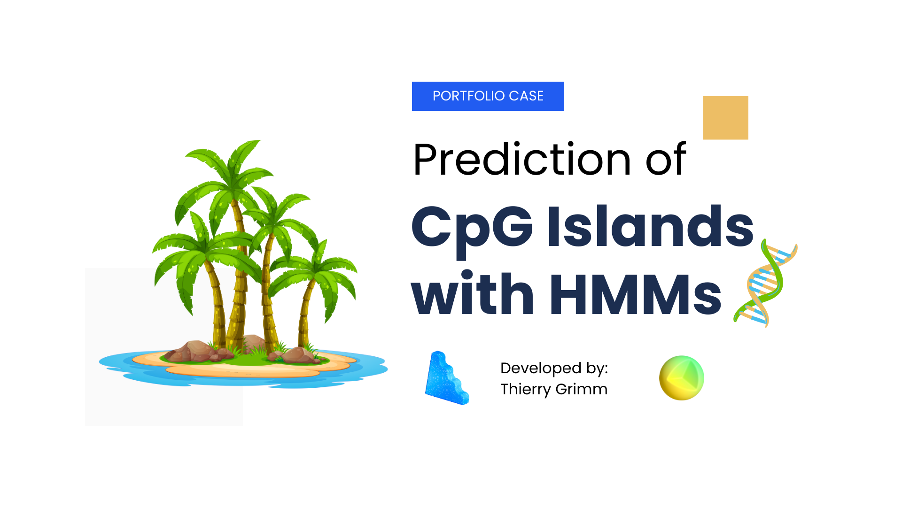
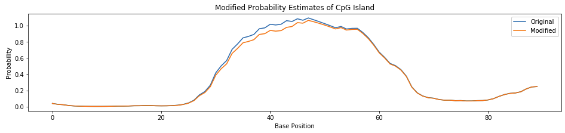
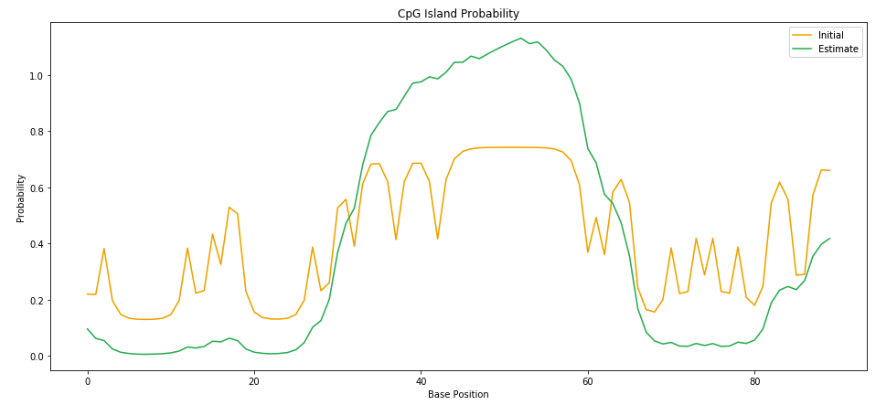

# CpGIslandHMM [](https://www.paypal.com/cgi-bin/webscr?cmd=_s-xclick&hosted_button_id=EFQXNQ7UYXYKW&source=url)

<div align='left'>

[](http://jupyter.org)
[](https://numpy.org)
[](https://pandas.pydata.org)
</div>

<details>
  <summary>Table of Contents</summary>
  <ol>
    <li>
      <a href="#project-description">Project description</a>
      <ul>
        <li><a href="#parts">Parts</a></li>
        <li><a href="#biochemical-foundations">Biochemical Foundations</a></li>
      </ul>
    </li>
    <li>
      <a href="#sections">Sections</a>
      <ul>
        <li><a href="#hidden-markov-model-viterbi-algorithm">Hidden Markov Model & Viterbi algorithm</a></li>
        <li><a href="#baum-welch-algorithm">Baum Welch algorithm</a></li>
      </ul>
    </li>
    <li><a href="#acknowledgments">Acknowledgments</a></li>
    <li><a href="#issues">Issues</a></li>
    <li><a href="#license">License</a></li>
  </ol>
</details>

## Project description

CpGIslandHMM predicts CpG islands with Hidden Markov Models (HMMs), the Viterbi, and the Baum-Welch algorithm.

:star2: Highlights:
1. CpG islands, associated with genetic promoter regions, could be reliably predicted.
2. Viterbi and forward/backward algorithms are susceptible to single nucleotide changes.
3. Introducing the Baum-Welch algorithm improved the prediction stability considerably.


### Parts

This project consists of two main parts

* [Hidden Markov Model & Viterbi algorithm](https://github.com/thierrygrimm/cpg-island-hmm/blob/master/Jupyter%20Notebooks/CpG%20islands%20Hidden%20Markov%20Model.ipynb)
* [Baum Welch algorithm](https://github.com/thierrygrimm/cpg-island-hmm/blob/master/Jupyter%20Notebooks/Baum-Welch%20algorithm.ipynb)

### Biochemical Foundations

CpG islands are regions with a high frequency of CpG sites. Many genes in mammalian genomes have CpG islands associated
with the promoter (start of the gene). In mammals, 70% to 80% of CpG cytosines are methylated changing the expression of
the gene downstream. This field of study is part of epigenetics.

## Sections

### Hidden Markov Model & Viterbi algorithm

We model CpG islands by creating a Hidden Markov Model (HMM) of the 1st order. The model assumes the presence of two
“hidden” states: **CpG island** and **nonCpG island**. We estimate parameters of the model by calculating transition,
emission and initiation probabilities from a set of sequences. Using the Viterbi algorithm we find the most likely
assignment of CpG islands in the test sequence. The results show that changing a nucleotide affects neighbors because
the forward/backward algorithm is used which is sequential in nature.

<p align="center">
  
</p>

### Baum Welch algorithm

We estimate transition and emission probabilities of the model only based on sequences containing CpG islands without
known keys. We use the Baum Welch algorithm, which is a special case of the EM (expectation maximization) algorithm. It
makes use of the forward-backward algorithm to compute the statistics for our expectation step.

<p align="center">
  
</p>

## Acknowledgments

* The dataset was kindly received from department of Computational Biology at the University of Basel

## Issues

Found a bug? Want more features? Find something missing in the documentation? Let us know! Please don't hesitate
to [file an issue](https://github.com/thierrygrimm/cpg-island-hmm/issues/new) and make a recommendation.

## License

```
CpGIslandHMM - CpG island prediction with Hidden Markov Models, Viterbi, and Baum-Welch algorithm.

The MIT License (MIT)

Copyright (c) 2020 Thierry Grimm

Permission is hereby granted, free of charge, to any person obtaining a copy
of this software ("CpGIslandHMM") and associated documentation files (the "Software"), to deal
in the Software without restriction, including without limitation the rights
to use, copy, modify, merge, publish, distribute, sublicense, and/or sell
copies of the Software, and to permit persons to whom the Software is
furnished to do so, subject to the following conditions:

The above copyright notice and this permission notice shall be included in
all copies or substantial portions of the Software.

THE SOFTWARE IS PROVIDED "AS IS", WITHOUT WARRANTY OF ANY KIND, EXPRESS OR
IMPLIED, INCLUDING BUT NOT LIMITED TO THE WARRANTIES OF MERCHANTABILITY,
FITNESS FOR A PARTICULAR PURPOSE AND NONINFRINGEMENT. IN NO EVENT SHALL THE
AUTHORS OR COPYRIGHT HOLDERS BE LIABLE FOR ANY CLAIM, DAMAGES OR OTHER
LIABILITY, WHETHER IN AN ACTION OF CONTRACT, TORT OR OTHERWISE, ARISING FROM,
OUT OF OR IN CONNECTION WITH THE SOFTWARE OR THE USE OR OTHER DEALINGS IN
THE SOFTWARE.
```
